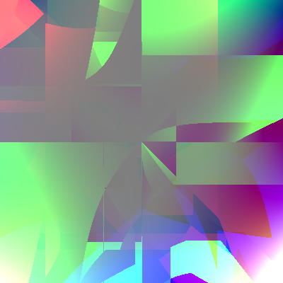

## RandomArt in python

An implementation of [Random Art idea](http://users.ece.cmu.edu/~adrian/projects/validation/validation.pdf) in python.  Inspired by https://github.com/tsoding/randomart

## Quick Start
To generate a randomart image
```bash
python -m randomart
```

To generate a randomart animation
```bash
python -m animate
```

## Examples

  
generated by the function
```
(if(gt(if(gt(-0.5831531409962822, add(0.4881374920873496, y)), -0.5363308990826867, if(gt(x, x), x, x)), mult(add(x, -0.3979345933425287), 0.005924638711300334)), if(gt(-0.7531879366483722, mod(y, x)), if(gt(y, y), y, y), -0.6988685901960758), if(gt(-0.6527899673280182, mult(x, -0.449032572506874)), if(gt(0.4990466171582677, 0.45054477619853106), -0.2123392270457356, x), if(gt(y, -0.993350726452094), 0.7644430003988048, x))), add(-0.1636800584703486, add(if(gt(x, 0.03205354156829099), -0.21411443565119748, y), mod(y, 0.9587572161753906))), if(gt(mult(mult(-0.9863596987901524, y), if(gt(y, x), x, y)), if(gt(if(gt(x, y), 0.1055739017904942, 0.3650533981892714), add(x, 0.4512269847509742)), if(gt(y, y), 0.5437715225362585, y), if(gt(0.035989977726246014, y), x, y))), add(if(gt(0.9491833056270289, 0.27379308474712905), y, x), mod(x, -0.19304693883730906)), 0.9265758698914437))
```


generated by the function
```
(if(gt(if(gt(if(gt(mult(mod(mult(mod(y, y), if(gt(0.6339704341709185, y), 0.19341773193753808, y)), if(gt(if(gt(0.4808168086528417, y), x, -0.5552428977340684), mult(0.633658985443331, x)), if(gt(0.5358355952219898, x), x, -0.8145062007305961), 0.5137468757833439)), -0.2159203783579835), if(gt(mult(mult(mult(x, -0.8118328874249869), 0.13889049928590547), if(gt(mult(y, x), -0.14971384976571556), add(-0.024131876450780743, x), if(gt(-0.4046227435961396, x), y, x))), 0.42987934750649726), mult(mult(mult(-0.10724943167424095, y), if(gt(-0.13114957175463648, -0.9646548288687495), x, x)), if(gt(mult(-0.38270139472379516, 0.8397130362566956), if(gt(x, y), 0.6066764413038463, y)), mult(y, x), -0.2900349244058904)), if(gt(if(gt(mult(0.7643636738877211, -0.45055054428800223), if(gt(0.1441159908421057, x), 0.2776304731950259, 0.5330707971269066)), add(0.1232561077632226, x), -0.4158778006909303), mult(mod(-0.857664919864386, y), if(gt(x, y), y, y))), -0.3579030830284149, 0.42316201581911117))), mod(add(if(gt(if(gt(y, y), x, -0.5035389758761406), add(y, -0.22840191973483082)), if(gt(x, -0.18279584090854195), x, x), if(gt(x, y), x, x)), mod(mod(x, -0.49523638774920253), if(gt(0.12509980154562683, y), y, 0.727155645825367))), if(gt(if(gt(0.04558476862566163, mult(x, -0.9588498523796953)), if(gt(-0.034457236368960587, y), x, x), if(gt(x, x), x, x)), add(if(gt(x, x), x, -0.3099151994339302), mod(y, x))), 0.860719701119002, 0.5810575736972132)), if(gt(0.8362594912005015, add(if(gt(if(gt(y, y), x, 0.9817564014287357), mod(y, y)), 0.5107262404552975, -0.13554036559108118), mod(mult(x, -0.5903070724735189), 0.3794522044518678))), if(gt(add(if(gt(x, y), -0.935403582337268, x), mod(-0.9329373725910908, -0.4601944201535484)), -0.6663129758619237), add(if(gt(0.6200816866495631, x), y, y), add(y, x)), if(gt(-0.03597889908795082, add(x, x)), -0.758480413510189, 0.9334157318722764)), if(gt(mod(mod(x, y), if(gt(x, y), x, x)), -0.16759936784454044), mult(mod(x, x), -0.06692041349573419), -0.005854089842331822))), add(0.5218841954123001, mult(mult(mult(mod(y, 0.3290560895084673), if(gt(x, 0.3001006138770288), 0.8946620590939534, y)), -0.10333807587744848), 0.5432151943131236))), if(gt(if(gt(add(if(gt(-0.14810040064281327, mult(x, -0.9356457164630305)), 0.9521902549034313, if(gt(0.28158044575248087, y), 0.4765938038150901, -0.6953974290213241)), mod(mult(-0.03023533091548547, x), -0.9545453885750452)), -0.9902247222104894), add(if(gt(0.5469145718978548, mult(x, x)), if(gt(x, y), -0.0028946883905740517, x), 0.5671261683494897), add(if(gt(-0.56025556840738, y), y, -0.6405753325487396), add(y, y))), 0.7594702490263541), mult(add(-0.6389524517329976, mod(mod(-0.4490294687314069, x), 0.9812921157083638)), if(gt(mult(mod(x, y), if(gt(y, x), x, -0.24856619778476352)), if(gt(if(gt(0.2378872461832302, x), 0.9361242659159079, y), add(x, y)), if(gt(0.6727212724747078, x), y, x), 0.9398371222391886)), mod(mult(x, -0.9378709143443171), if(gt(y, y), -0.7081144435984839, -0.37295126773894505)), 0.5843245786473032))), if(gt(add(if(gt(if(gt(0.6234849503605202, x), y, y), mult(x, 0.506219242553138)), if(gt(0.44794523260316854, y), y, y), if(gt(-0.11655291919319088, y), 0.36808346602788844, x)), add(0.641872676597079, add(y, -0.8453082658668865))), if(gt(if(gt(if(gt(0.7657739448146135, 0.4353442062030921), 0.5730207488211083, 0.607820579799287), mod(-0.0478351080542061, y)), if(gt(0.3443465896854512, x), x, y), if(gt(0.9518941696818364, x), x, y)), add(0.556992081980642, add(0.4323409768645188, x))), 0.6840295820184092, if(gt(add(x, y), 0.1620591158203899), add(x, x), if(gt(y, x), x, x)))), add(-0.945951706160185, mult(mult(x, y), 0.19380553013961932)), -0.5303657646894222), if(gt(if(gt(if(gt(mult(x, y), if(gt(x, 0.905765255140289), 0.6573700112573386, y)), add(y, y), if(gt(-0.5486861935506331, x), 0.6482112604136572, y)), mult(add(y, x), 0.3117750102873016)), if(gt(add(y, 0.6785570569757644), 0.07717816337184691), mult(y, y), if(gt(y, y), x, x)), if(gt(-0.2931343301645104, add(0.7527700676116784, y)), -0.5952299885157624, if(gt(-0.6777695899571778, x), y, x))), add(if(gt(0.16575016884408766, mult(y, x)), if(gt(y, x), x, x), if(gt(y, y), 0.8007296095517109, 0.05805695957308843)), mult(mult(y, y), if(gt(y, x), 0.8644271510540082, y)))), if(gt(if(gt(mod(-0.17191846367910668, y), if(gt(x, x), -0.16387202855378824, y)), add(0.16370931329278404, -0.16951019161621939), -0.36499020482232214), mod(add(-0.6877949967246169, y), if(gt(-0.7791446113270002, 0.9784591331292782), x, y))), if(gt(0.012041708823518515, mult(y, x)), if(gt(y, -0.5246849521329788), x, -0.046739241076281246), 0.6897610937748944), if(gt(if(gt(x, -0.7942324322218208), y, x), mod(y, -0.021177887908060855)), 0.5468704997681368, if(gt(0.07821173517379365, y), -0.7676616203192883, y))), -0.8058195682478881)), -0.525362736014285), mult(add(-0.9451980235173985, mod(mult(add(if(gt(y, y), y, 0.9188322433605198), mod(0.8334047517333365, x)), if(gt(if(gt(y, y), y, y), add(x, x)), if(gt(y, 0.9812245018023638), y, -0.407594507718426), -0.3308204954459497)), -0.055488846491723365)), if(gt(mod(add(if(gt(if(gt(0.8412227047538778, y), y, x), add(-0.6328762118824853, -0.5622811219077068)), 0.9803726071429661, if(gt(0.20648984712125684, x), y, y)), add(if(gt(y, x), y, 0.03372653281352611), mod(x, y))), -0.7957898733079598), 0.9038649648337587), mod(mult(add(if(gt(y, y), x, 0.5020802558048352), mult(0.90784433727724, 0.767223272376049)), if(gt(if(gt(-0.7364442837473335, y), -0.28207753678901293, 0.13701578695908578), mod(0.7967977414186689, -0.5682525424141138)), -0.605259531344917, if(gt(y, x), -0.17759781912531203, y))), if(gt(if(gt(mult(x, y), if(gt(x, y), -0.13839452466793034, -0.1004071397517623)), mult(y, x), if(gt(x, -0.9756242333698719), -0.25657453070439007, x)), mult(add(x, 0.22448861149435162), if(gt(0.3603770045717114, x), 0.1731633109668067, x))), if(gt(0.4344099051104122, mod(x, y)), if(gt(y, x), -0.9087594602602964, 0.9439456035027467), if(gt(-0.7713705458675122, y), y, x)), if(gt(if(gt(0.3826279902797247, x), -0.6037435054066693, -0.11364389151054666), mod(-0.2022872062352088, y)), if(gt(x, 0.5557696189778951), x, x), if(gt(y, x), x, -0.6519211279516413)))), 0.6872972577653909))), if(gt(0.2309366479386883, mult(mult(add(if(gt(if(gt(-0.4532751522996268, y), 0.5368795724197646, y), add(-0.45565825870591725, 0.27325473184283267)), -0.38915132439233124, -0.36102533564062145), mult(add(x, x), if(gt(0.7612830073957455, y), -0.22040868044691253, 0.6274145740803077))), if(gt(mult(mod(x, y), -0.746141796465325), if(gt(mult(y, x), if(gt(0.7831538002169971, -0.4878972254269991), -0.09033576204722626, -0.3845243695970806)), mod(x, x), if(gt(x, y), y, x))), mult(mult(-0.07076580809398902, y), if(gt(-0.3592432439829927, y), -0.9477770538318517, x)), 0.22279224353681348)), 0.7918877279809919)), if(gt(add(-0.5368665378581245, mult(mult(mod(x, x), -0.07017709853939857), if(gt(mod(x, 0.9629834313028298), if(gt(x, -0.14926966957201127), x, 0.8475495020215191)), add(0.5009897037334834, x), -0.4546899724548932))), if(gt(if(gt(add(-0.4408778147688708, mult(0.9791330513484955, x)), if(gt(if(gt(y, 0.8269718218787829), -0.18486626996819333, -0.36690746534046714), add(0.6559944658654675, y)), if(gt(y, -0.576788190835315), y, x), 0.8288856732087075)), add(0.14114861287138347, add(y, -0.20808976306785398)), 0.3458824085104468), add(if(gt(mult(-0.9766279697551379, y), if(gt(x, x), 0.18131525335369236, -0.9207884864455904)), add(y, y), -0.41945625218317595), mult(add(-0.9174772278501628, x), 0.4054647977165924))), if(gt(if(gt(if(gt(x, x), -0.9302321963214428, -0.5338459604743115), mult(y, y)), if(gt(-0.09986958455560191, y), y, 0.7755460010227193), if(gt(x, y), -0.7502963099484967, 0.3622846396419963)), mult(mult(y, y), if(gt(0.4451945493530194, 0.39748699878547855), x, x))), if(gt(if(gt(y, -0.9051340581454921), x, y), mod(x, y)), 0.03955132318908894, 0.2779381798674385), if(gt(-0.26968662800691456, mult(y, 0.5039801345221926)), if(gt(x, x), y, x), if(gt(0.24100032493211, x), -0.441914112516534, x))), if(gt(mult(add(y, x), -0.5960507933562005), 0.19754085864252224), mod(add(0.4688831026563154, x), if(gt(0.6478371324998831, y), y, x)), if(gt(mod(y, -0.9428763733423573), if(gt(x, 0.614947193472112), -0.2210410833226808, y)), mod(0.7961987877426637, -0.8672374680883872), if(gt(x, y), -0.3215637981600663, y))))), mod(add(if(gt(add(x, 0.6877687042314113), if(gt(0.7289791004264661, x), x, -0.6334750278340391)), mod(y, -0.8972263880099947), 0.6904408892049942), mult(mod(-0.9804689576225283, x), if(gt(y, x), x, 0.13255174424204963))), if(gt(if(gt(add(y, x), -0.3932011687948309), mod(0.7495339423408989, x), if(gt(x, y), y, 0.9334165863166117)), mod(add(y, y), if(gt(0.11509814834684673, y), 0.9675678382912958, x))), 0.45781505804314127, -0.1881847116796671)), if(gt(add(if(gt(mult(x, x), if(gt(y, y), y, y)), mult(y, y), -0.9206062271171775), mult(mult(y, x), if(gt(y, y), y, 0.7999365448348694))), if(gt(add(0.30212527838767333, add(y, x)), if(gt(add(-0.6007561242591004, y), if(gt(x, x), x, -0.9879580950472078)), mult(x, -0.5837643059799857), 0.2485992540428228)), mult(add(0.47919310080247546, y), if(gt(x, -0.5854558603162037), y, x)), -0.4600731470276844)), mult(mult(mult(0.43733441585240684, -0.15637874542702113), -0.4989547197582478), if(gt(if(gt(-0.1445284149674959, y), y, 0.305627281815154), mult(y, x)), if(gt(0.707578994105895, 0.8910463890298348), -0.21975788592838952, x), if(gt(x, y), 0.5319002413828111, y))), if(gt(if(gt(-0.6397076027609456, mult(x, x)), if(gt(y, y), 0.8899783817031275, 0.09298050012587589), 0.4554953896251248), mult(add(0.3345897009364802, x), if(gt(y, x), -0.5151115421036703, x))), 0.004012830188456773, if(gt(if(gt(y, y), y, -0.9419427106694358), mod(y, y)), if(gt(0.0613710853649716, 0.12959733128624662), 0.1875813933206909, y), if(gt(x, -0.6593566273349787), y, x))))), 0.8575066201835904), 0.9465245389048935), add(if(gt(-0.6558048652862938, mod(mult(mod(mult(mod(x, -0.7828837349613667), 0.4461802829921391), if(gt(if(gt(-0.18603995282152952, x), x, 0.228011421656394), mod(y, -0.49415145794030035)), 0.46008488287046356, if(gt(0.30727174095722787, x), -0.17432902552847196, y))), if(gt(mult(mult(-0.4801279460599086, -0.2215958608955262), if(gt(y, x), x, x)), if(gt(add(y, y), if(gt(0.9445416550341472, 0.2450621821045822), y, y)), add(y, x), -0.6598088189152118)), add(if(gt(x, 0.7602424739870917), y, -0.28493722787608533), mult(y, -0.7652111226744573)), if(gt(0.8928419651374937, mult(-0.9084704472411707, -0.9867491989077302)), if(gt(y, y), 0.5218678268203691, -0.7286393083220479), 0.04478701260105722))), 0.4285565686418171)), 0.6840712334543952, if(gt(if(gt(if(gt(-0.7976241236077348, mult(add(y, 0.31343356423616453), if(gt(x, x), y, -0.4755664323491986))), if(gt(if(gt(y, -0.6883833632854162), -0.24306522936834574, y), mult(0.46671775941344684, y)), if(gt(x, x), y, x), 0.3445097500979022), if(gt(mult(0.4406504197983696, -0.1616596078452377), if(gt(y, x), y, y)), add(-0.9016724423150315, y), 0.27799301309075153)), mult(mult(add(-0.10692312350866451, -0.6062036989521042), if(gt(x, y), 0.49331752119182126, x)), if(gt(mult(x, 0.3033624235159931), 0.38438627178393436), add(x, -0.03927429853133235), if(gt(x, -0.4043617497736609), 0.002049521462984538, x)))), if(gt(mod(add(y, x), if(gt(x, x), y, -0.2647608385385758)), -0.619189215581686), mult(mult(0.9687083627283981, x), if(gt(x, 0.3648122790485373), y, y)), -0.9383334026077752), 0.69778815110485), mult(mult(add(if(gt(x, y), y, x), mult(y, y)), if(gt(-0.33629478612257535, mod(y, x)), if(gt(-0.6814184962302401, x), y, x), if(gt(y, -0.8615253193177244), x, y))), if(gt(-0.15555468981440268, mult(mod(0.26750348411417013, y), if(gt(0.1970627638491922, 0.7307323473722569), -0.39419039736178885, x))), if(gt(if(gt(x, y), x, y), mult(x, 0.07673637367327601)), if(gt(y, y), -0.3272430421321677, x), if(gt(y, x), x, y)), if(gt(add(x, 0.2648765159417279), if(gt(y, x), x, -0.6066546475635646)), mod(0.7908220500719083, -0.8443209624647918), -0.6458694001239302)))), 0.9733925034307538, -0.04016795656422345)), add(-0.14637976967837107, mult(mod(add(-0.3223057392046895, mod(mult(-0.17470287735633572, x), if(gt(x, -0.20079121491087681), y, y))), if(gt(if(gt(add(x, x), if(gt(y, 0.9349804095442951), -0.047128848253812805, y)), add(-0.9294322265877968, 0.7447754199874272), if(gt(x, 0.045359700983119255), y, x)), mod(add(0.20597126100310836, x), if(gt(x, y), -0.9994142790692264, x))), if(gt(add(y, y), -0.1864665200020299), mod(-0.020891026633488963, y), 0.5562367170072751), 0.9406044452075661)), if(gt(mult(add(if(gt(x, y), -0.7662617229047379, 0.5260571372121112), mult(-0.18240727367086107, x)), -0.08696933614407354), if(gt(mod(add(y, y), if(gt(x, y), y, -0.4789776556231067)), -0.47149247741258926), mod(mod(y, y), -0.30081728609551317), if(gt(add(y, x), -0.8890205616021338), mult(-0.4310527131529174, -0.06791753570422498), 0.019963588730113058))), add(-0.03623166215637097, mod(mult(y, -0.39293127506931125), if(gt(y, y), -0.780895102524569, x))), if(gt(mult(mod(x, y), if(gt(x, y), x, x)), if(gt(if(gt(y, x), 0.3393963239315503, x), mult(x, y)), -0.9901194055454476, 0.10165451218361854)), mult(mult(y, y), -0.5442789254903084), if(gt(if(gt(y, x), x, y), add(-0.8602265995030833, x)), if(gt(x, 0.1797201018075676), x, -0.9987530317330413), if(gt(-0.8774449723517681, 0.5157138254117457), y, 0.5909985091393795))))))), if(gt(if(gt(add(0.06575090366433378, add(0.03020253001782147, add(if(gt(add(y, y), if(gt(x, y), x, -0.4375604930579746)), mod(y, 0.4781018817384368), if(gt(x, -0.28157419484991086), -0.19781363514377714, y)), mod(mult(x, x), if(gt(0.19717319297285396, x), -0.34620259821990906, -0.09231911713720509))))), if(gt(0.0845629027329089, mod(mult(mod(add(-0.3717442123278345, x), if(gt(-0.8896828184657137, -0.5918172148931529), 0.678262904234552, x)), 0.9119161309819668), 0.2841007313463437)), 0.47972792141893894, if(gt(if(gt(-0.7865740294046866, mod(mult(x, y), if(gt(y, -0.2503180768951918), x, -0.37355277046177005))), 0.7412767923659522, 0.040744114628244565), add(-0.2455348171142322, add(if(gt(x, x), y, 0.8577290558967614), mult(x, y)))), if(gt(if(gt(mult(-0.7679315671651772, -0.3478097103437183), if(gt(y, 0.8128263372535678), 0.18031872909677893, 0.5439381827764282)), mult(y, y), if(gt(x, y), -0.3259801780112461, x)), add(if(gt(y, y), -0.3317230098070467, y), mult(x, 0.3172378922326269))), if(gt(mult(y, x), -0.6342904613048501), add(y, x), -0.6799052551378404), if(gt(mod(0.8916039442475727, x), -0.9827865243215164), add(x, x), if(gt(y, x), x, y))), if(gt(add(if(gt(x, -0.06854657429739963), x, y), mult(0.8800775238547676, 0.8347170217107742)), if(gt(add(-0.2577794049584048, y), -0.1477554652659292), mult(x, x), if(gt(x, -0.45926957234113175), y, x))), mult(add(x, x), -0.49688315892516965), if(gt(if(gt(y, 0.34581935458235646), -0.11501242072293572, x), add(y, 0.6157842025610558)), if(gt(y, y), x, -0.47772272284849504), if(gt(y, y), y, y)))))), mult(mod(mult(add(if(gt(x, x), y, 0.6209645370706145), mult(-0.1909209418709772, y)), -0.05836600597391328), -0.9045823427344812), if(gt(mult(mult(mult(-0.05550141780318785, y), if(gt(-0.7591600784910506, 0.7381616201806822), 0.8717866056000019, 0.09437072758887433)), if(gt(if(gt(-0.6263925638513199, x), y, x), mult(y, x)), if(gt(y, 0.36279585390586333), y, y), 0.9429565018043984)), if(gt(-0.7229540896693525, mult(add(-0.9128195466734625, -0.7242275601541506), 0.8183853827953924)), if(gt(if(gt(x, x), x, y), mod(0.5191131020151394, x)), 0.10091734352528547, 0.15181084743303463), if(gt(if(gt(y, 0.8692290001619931), x, y), add(y, 0.8017589955230178)), if(gt(0.41045640320399435, y), 0.590702347281072, -0.6384446615235819), if(gt(-0.5640686500136416, y), x, y)))), mult(add(if(gt(-0.7684961689477452, 0.43326539538837494), x, -0.04610412528991503), add(0.7406835812437946, x)), 0.6182804983927641), -0.5879846659574688)), if(gt(if(gt(mod(mod(add(x, 0.20563545430562957), 0.8581120558782545), if(gt(add(x, y), -0.8334023693467214), mult(x, -0.7869521113160456), if(gt(0.9851441809114898, 0.7876178189480569), y, -0.2059477215178418))), if(gt(-0.07199608773483734, mod(mult(y, x), if(gt(x, y), x, x))), if(gt(if(gt(y, x), x, x), mult(x, 0.40077447993352355)), -0.13892987445169647, -0.9851336430440287), if(gt(if(gt(0.6637297426611628, y), x, -0.5627994145550352), add(0.6511877712509422, x)), -0.9470874505205595, -0.44757715236924045))), mult(add(0.03876277419063534, mult(x, 0.7322487417386496)), 0.3101822409262269), if(gt(mult(add(y, x), if(gt(x, 0.42729093765945203), y, x)), if(gt(add(y, x), -0.7177654909108633), add(x, -0.2943118164181091), if(gt(0.8662949547266021, x), y, -0.474808005691042))), add(if(gt(x, y), x, x), mult(x, 0.6493788089984334)), if(gt(if(gt(y, x), x, x), mult(0.10149886839283218, 0.4063102370411542)), if(gt(0.6063266919545642, -0.15084116866219244), x, -0.06909472689420504), if(gt(x, -0.32381238270624224), -0.494109336852703, x)))), mult(mult(mod(mult(x, x), if(gt(y, 0.2549773330989473), x, x)), if(gt(if(gt(y, y), y, x), mult(0.6199337691631297, -0.9879724188062446)), if(gt(x, x), x, y), -0.8636321826135667)), if(gt(mod(mult(y, x), if(gt(x, y), -0.3348968304352953, y)), if(gt(mult(0.8149101637943417, x), 0.6917058395250921), add(0.7223689286516017, x), if(gt(0.18841280854849152, x), x, x))), mult(mod(0.051784579577055734, y), -0.8114237133185638), if(gt(mult(y, x), if(gt(0.44482368874164124, 0.4190459182843864), -0.5422783869526051, 0.7588020534357152)), add(0.7141443542379158, x), if(gt(x, y), 0.5705551753697751, y))))), -0.455341100218726, if(gt(mult(add(0.9512738013196274, mult(y, -0.621177482422774)), -0.580948980066571), if(gt(mod(mod(x, -0.5473680122823785), if(gt(x, x), x, x)), if(gt(-0.19875478541674108, mod(0.7722041015131405, y)), if(gt(0.587651691583507, -0.0532570091921285), 0.1206427551564555, 0.5736744942441372), if(gt(0.5974550186925827, x), x, x))), add(0.7287147095697912, add(-0.8038987267125888, y)), if(gt(0.7232101565403566, add(0.7057854799657155, x)), -0.4934218396651662, if(gt(-0.024201386077513876, x), -0.6089953827754018, y)))), mod(mult(mod(-0.04118319778249813, x), -0.26923923453059007), if(gt(-0.1942815381378611, mult(0.8299914764178407, y)), -0.8798049922685469, -0.21271301004576126)), if(gt(mult(mult(-0.5010663820535883, y), if(gt(-0.8317382945544205, -0.5098327165734224), x, -0.6565821377585526)), -0.3886399078452567), mult(mult(x, -0.4400314713764686), if(gt(0.8949913567742798, x), x, x)), 0.5870231938636516)))), mod(add(if(gt(if(gt(if(gt(add(-0.5476540216378492, x), if(gt(y, 0.45364437633093924), y, y)), add(y, 0.5250932563369264), if(gt(x, -0.4211750863171002), x, 0.5211508729860539)), mult(mult(y, 0.36078470819821584), 0.22705725805624866)), if(gt(add(0.2808701917863059, x), if(gt(y, y), -0.8378334569382138, y)), add(y, y), if(gt(x, x), -0.12529618551683885, y)), if(gt(0.835239314107195, mult(0.8803060769988968, -0.08669703685143926)), if(gt(0.2710775995046393, 0.29024821998632255), 0.1411446824069793, x), if(gt(y, -0.39012475747688447), 0.5379385569850359, 0.9149176316270355))), mod(add(if(gt(y, y), -0.5935505820799987, x), mult(y, y)), if(gt(add(0.7636244469231659, x), -0.14657241505041685), add(x, y), if(gt(0.846783600352415, -0.8244861927416107), x, -0.48612305861687233)))), if(gt(mod(mult(x, 0.1375785581346245), if(gt(x, x), x, -0.35349742664973083)), if(gt(mod(y, y), if(gt(x, x), x, y)), mod(y, x), -0.3613997327514886)), mult(mod(x, x), 0.8689823471179681), if(gt(mult(-0.6126936305791038, y), 0.653437054501508), add(y, x), if(gt(-0.5459810623067822, y), y, y))), if(gt(mult(mod(y, 0.24767221932151795), if(gt(x, 0.7216956541725235), -0.4583353909512662, 0.5159866109890567)), if(gt(mult(-0.5935056694128469, y), -0.25719896758141925), mod(0.4635728770810137, -0.017632664313138813), 0.4319387793007585)), add(0.8177319603840845, mult(x, x)), if(gt(if(gt(y, 0.5712686832467664), y, y), mult(0.8330595627455872, -0.7761347027488401)), if(gt(x, y), y, 0.14870344403820712), if(gt(0.16581259843281004, -0.6119183980783711), x, -0.0825483892359673)))), add(if(gt(mod(mod(x, 0.034305061197798414), 0.3911783792979828), if(gt(-0.23608976534517256, mult(0.8602666781075599, x)), if(gt(y, 0.3944004230912106), y, -0.9749716169643874), if(gt(x, 0.7354739658523981), x, x))), mod(mult(-0.25101311690948047, 0.28619876309305825), if(gt(y, x), x, x)), if(gt(0.6869022772869411, mult(0.46583873644972584, -0.29247853321326045)), if(gt(y, -0.9727195540619751), 0.48563793186840876, x), if(gt(x, -0.4815421167610392), y, -0.9576497626564862))), mod(add(0.31363784266627626, mod(0.9232816012341878, y)), if(gt(if(gt(y, x), 0.46353537147145984, x), mult(y, x)), 0.14361950326680617, if(gt(y, x), x, x))))), if(gt(mult(mult(add(if(gt(0.6639121663025649, 0.14961064922342682), 0.7616323819949604, -0.9517216416593353), mult(-0.5809041215596362, x)), if(gt(mod(y, x), if(gt(-0.9214246100394925, 0.3963339378245436), 0.29382138491120924, y)), add(x, y), if(gt(y, x), x, 0.4610916858288179))), if(gt(if(gt(mult(y, -0.08895343544677803), if(gt(x, x), x, -0.41064896937936557)), mult(y, 0.6963889607450844), -0.875078572560672), mult(add(-0.15941710496002148, y), if(gt(y, y), y, -0.0755666501839336))), if(gt(0.755060913566328, mult(x, x)), if(gt(y, 0.49627542293510096), 0.024860422804423132, y), if(gt(y, 0.38325234815157616), x, x)), if(gt(if(gt(y, y), -0.8111164511001938, 0.9590162318736024), mult(x, y)), if(gt(-0.6125873529553754, x), x, y), if(gt(y, x), y, 0.6293128721858201)))), if(gt(add(if(gt(if(gt(0.7435372736637049, y), y, y), add(0.6307839765424881, x)), if(gt(x, x), x, -0.16644656133518843), 0.5952886724866153), mod(add(x, x), 0.9941284654479363)), if(gt(-0.3164131589203527, mult(mult(x, 0.23644357741511524), -0.9539953565718706)), 0.8088376335956202, if(gt(mod(y, -0.9741380663117187), 0.8482317562257682), mult(-0.4582024289159643, -0.3758217318603403), if(gt(x, y), 0.30533343327798423, y)))), mult(mult(add(y, 0.5982848361596134), -0.7419688951743577), if(gt(if(gt(x, -0.8127298400792631), x, y), add(0.869746750798543, y)), if(gt(-0.3459294553378729, -0.11202668131862481), -0.24018455080121326, x), if(gt(x, y), 0.6881931107262136, -0.6288218810097186))), if(gt(if(gt(if(gt(-0.24492272003239246, x), y, y), add(0.3937746565882436, y)), if(gt(x, 0.1342323321150949), y, x), if(gt(x, x), -0.6320197023471357, 0.5577227463862631)), mod(mult(0.3896360178348599, y), -0.7760714767203949)), 0.33699531895682466, if(gt(if(gt(y, x), -0.8280025979110641, x), mult(0.7069040128138442, y)), if(gt(-0.8711466340228711, x), x, -0.5782579171269673), if(gt(0.028833406376173265, y), x, 0.49800998378867245))))), add(if(gt(if(gt(mult(x, y), if(gt(y, x), y, 0.10948985029206182)), mult(y, y), -0.27369721243517176), mult(mult(-0.19832943093437994, -0.41825357140998287), if(gt(x, y), y, -0.12864574506756177))), if(gt(mod(-0.07549448081577115, -0.9657833546673227), if(gt(-0.46998965935218195, 0.8622121272248879), y, y)), mult(-0.8566270209691291, x), if(gt(0.8123365802038098, x), -0.8271502919695721, x)), if(gt(mod(x, x), 0.18891997709304897), mod(y, x), 0.6192043208444278)), mod(mod(add(y, y), if(gt(x, x), -0.6044091795310564, y)), 0.6924959427979833)), if(gt(mult(add(-0.3313875860876021, mod(0.17730122491804723, x)), -0.08130206106162641), 0.24098153377809073), add(-0.25458721847213095, mod(mult(x, y), -0.6558185019217861)), -0.23022922083745412)))), if(gt(mult(mod(add(if(gt(0.24514548853335372, add(0.29767183093014005, -0.9064302378965909)), -0.3308456295424498, 0.6820468341059445), add(if(gt(0.9447320715866716, y), y, y), add(y, x))), if(gt(mod(mult(-0.9616223116397364, x), -0.5265056810103372), if(gt(if(gt(-0.9707222339467156, y), x, y), mult(x, x)), 0.06433933594765873, if(gt(-0.75234824364445, y), y, x))), mult(mult(x, y), -0.07139299244014885), if(gt(-0.7873246624086359, add(y, y)), if(gt(0.12124066545238876, y), x, -0.21410621369588867), if(gt(y, 0.7707989731157503), x, x)))), if(gt(if(gt(mod(mult(y, x), if(gt(y, -0.44217109610467387), x, y)), if(gt(mult(-0.17515112673869337, 0.8384750223492248), if(gt(y, -0.19455338813770084), 0.4398628096893791, x)), mod(x, -0.6715627151608425), -0.7440715133464937)), add(if(gt(y, 0.5697034938619119), y, x), add(0.32714012507210577, y)), if(gt(if(gt(-0.43951261986097667, y), x, x), add(x, -0.8947273369387012)), if(gt(x, y), 0.4952614369324486, x), if(gt(x, 0.4900030052085771), -0.7473714314605422, x))), mult(mod(add(-0.4763232353325373, x), 0.8750712065115784), -0.30342418162385965)), if(gt(mult(add(x, -0.5587785689358784), if(gt(0.4281848264740957, y), x, -0.09931890656830755)), -0.5846601795823931), add(-0.2831313255779173, mod(0.7757743722083976, -0.06147379311856138)), if(gt(add(x, -0.16299303652153996), if(gt(y, x), 0.853921127524335, y)), add(y, x), if(gt(y, y), y, x))), if(gt(mult(add(0.879923313160869, y), if(gt(x, 0.2846852402487532), -0.15701654203535909, x)), if(gt(0.42720607242003483, mod(-0.5470664391318454, 0.6308777712728761)), -0.7032903403002182, if(gt(y, y), x, y))), add(-0.07177945047172285, mod(x, y)), if(gt(if(gt(x, y), x, x), mult(x, y)), if(gt(x, 0.018561301683074127), y, y), 0.770717540401912)))), if(gt(add(-0.08592701172233208, mod(add(0.4564167076145278, mult(y, y)), if(gt(if(gt(y, 0.7588401061258645), y, 0.05646623444262233), mod(0.1292716557702589, x)), if(gt(-0.4696462582026113, y), y, y), 0.83302238325847))), -0.9018514732478833), mult(mod(add(if(gt(y, x), x, x), mult(-0.4448694864476117, -0.9479954917004778)), if(gt(mult(x, 0.9429084248370299), if(gt(y, y), x, x)), mult(y, x), 0.7331887522144422)), if(gt(if(gt(mod(x, y), if(gt(y, 0.9729652120305863), x, x)), add(y, x), if(gt(x, x), 0.35948128495014364, x)), add(0.7702385221815444, mod(0.7775837622496884, y))), 0.734321325317838, if(gt(0.4729629990251165, add(y, -0.19079866120481404)), if(gt(y, -0.9079758260240913), x, -0.6154987666163321), if(gt(-0.4207776475802001, y), 0.9535840643182063, -0.028716546881941696)))), -0.7353120889487019)), add(0.5349147096641256, mod(mult(add(if(gt(x, y), y, -0.5256438685747875), mod(y, y)), 0.4498948918746455), if(gt(if(gt(if(gt(y, 0.5221525122234563), y, x), add(0.139800361831236, 0.15281534816980713)), if(gt(-0.55060903357589, -0.40679335107977344), x, y), -0.032602064652028195), mult(mod(x, x), if(gt(x, x), -0.5950772192728293, x))), 0.04126294917658169, if(gt(if(gt(x, -0.08897773348876803), x, -0.6393400098447681), mult(y, x)), if(gt(x, y), x, -0.5517871971227772), if(gt(x, -0.5990575979771577), x, -0.29933954316236333))))), if(gt(mult(mult(mult(add(y, -0.9228900012249761), -0.17784987855158452), if(gt(mult(y, y), if(gt(x, -0.42546397896126864), x, -0.06703860548371798)), mult(x, x), -0.491383797363137)), 0.0709119885908096), if(gt(mult(add(0.5854366795248711, mod(x, y)), if(gt(mult(-0.7830915876593345, y), 0.9686725951361326), mod(x, y), 0.9287954568042986)), 0.2579494065193808), mod(add(if(gt(y, y), -0.7199379410656943, x), add(x, 0.7213272944472338)), if(gt(if(gt(y, 0.7478528944713667), y, x), mult(x, y)), if(gt(-0.6644369166377917, y), y, y), -0.3151540534928896)), if(gt(0.17007317562397706, mult(add(x, y), 0.26716076383908227)), if(gt(mod(0.6080923461845211, x), 0.2280331661027648), add(y, x), if(gt(0.19682891758070964, x), -0.2894090018321662, y)), if(gt(if(gt(x, -0.8076296393058375), y, x), mult(x, -0.5506420484450074)), if(gt(-0.8336889582826144, x), y, x), -0.9885248717635973)))), add(if(gt(if(gt(mult(-0.33562402602477204, y), if(gt(y, y), x, x)), mult(y, 0.3180865224921181), if(gt(y, 0.8116645165604912), x, y)), mod(add(y, y), 0.8546749062202466)), -0.28562650760495445, if(gt(0.16005756012143757, mult(y, x)), if(gt(0.5258458935717711, y), -0.5045246738563414, -0.23509158740035496), 0.8813007117339886)), add(0.5540026857212261, add(if(gt(0.0010154269465929566, 0.24835195231142793), x, y), mult(y, x)))), 0.7757202668513656)), -0.8821930691952151))
```

  
generated by the function
```
(if(gt(add(mult(if(gt(if(gt(y, y), y, -0.6837559395317525), x), add(x, 0.3690434250739867), x), add(if(gt(add(y, -0.8410319369544434), if(gt(x, y), -0.5361842375510202, 0.7584608188110287)), add(y, y), add(x, x)), add(if(gt(x, y), x, -0.9996966122021773), mult(y, y)))), if(gt(y, if(gt(if(gt(if(gt(add(x, y), x), add(y, 0.11247808854156127), if(gt(0.0234292520433248, y), y, x)), if(gt(y, mult(x, x)), -0.8024836883036655, if(gt(y, y), x, y))), y, x), add(if(gt(0.577109412069595, y), mult(-0.2945211210693297, y), mult(x, y)), mult(0.10670648009826023, if(gt(-0.47742407037851664, x), x, x)))), if(gt(add(-0.5314302131284745, x), x), mult(x, y), mult(-0.057562392252038075, x)), if(gt(add(mult(x, -0.3479572390830714), add(-0.6000263397069663, y)), if(gt(-0.049732812165075746, 0.783993326885768), x, x)), if(gt(y, mult(y, 0.5836809940699188)), add(0.42477679336263474, x), y), add(mult(0.5967750959350433, 0.9699817305245628), add(-0.34992668345344624, -0.37786935347593276))))), mult(mult(add(if(gt(-0.20670950624682138, y), x, 0.06153230978915625), add(y, -0.15542758095005138)), if(gt(x, mult(y, y)), mult(-0.29469615816695094, x), x)), if(gt(add(mult(0.227398229876435, x), if(gt(x, y), x, 0.822598067189523)), add(0.19764589605406413, add(y, y))), mult(y, -0.2538659572226878), y)), if(gt(add(add(y, y), mult(y, y)), if(gt(mult(if(gt(x, 0.9647697879899548), x, x), if(gt(y, x), -0.5489598509691112, y)), if(gt(if(gt(y, -0.47133557169962637), y, y), x), mult(y, -0.40894196578988296), mult(0.8718148305091598, 0.24791063792012324))), if(gt(add(x, x), -0.8993975986643881), add(x, x), mult(y, 0.9307287574161107)), if(gt(x, -0.8399899881874084), 0.7379696285584258, y))), mult(add(y, y), if(gt(y, y), -0.3862635003862389, y)), add(add(mult(y, x), if(gt(x, x), -0.6300926166164527, 0.7697782332659364)), if(gt(x, -0.29716780314296565), 0.3906218482977273, x))))), if(gt(add(add(mult(if(gt(x, x), add(y, -0.2834143622132197), add(-0.21163534701218367, -0.5281601337104183)), add(add(y, x), if(gt(x, y), -0.13636951050695356, x))), mult(if(gt(mult(x, y), add(y, y)), add(y, x), add(y, -0.33516477949200874)), if(gt(mult(-0.08139666430469394, y), add(x, y)), add(y, 0.07678279120534626), if(gt(y, x), y, x)))), add(add(mult(add(-0.8966464421348339, y), if(gt(y, x), y, y)), add(add(-0.01952378682328182, -0.05278909626830708), if(gt(x, x), x, -0.4395571360096098))), add(mult(-0.08318011721730945, if(gt(y, 0.15903905592878909), y, y)), 0.9769844993525463))), add(mult(add(if(gt(y, y), x, x), mult(y, -0.7633734193037185)), add(y, add(y, 0.26384783142409485))), if(gt(add(mult(if(gt(0.05404537667849163, y), x, x), mult(-0.7197143028426214, x)), mult(if(gt(-0.9867798469751106, -0.721541706399077), y, -0.6016950177886469), mult(x, -0.4370475412532546))), mult(mult(y, x), add(if(gt(0.7836313957224572, y), x, y), y))), mult(mult(add(x, -0.5081650375783864), 0.24598580172723317), add(add(x, 0.9580778683419049), if(gt(x, 0.7184106271512127), y, x))), if(gt(mult(y, x), if(gt(y, 0.9775123087432576), 0.8667331446706432, -0.004297044789464799)), add(x, y), add(0.2466234979994506, 0.9612536205959992))))), if(gt(mult(if(gt(x, if(gt(mult(x, y), add(y, x)), add(y, 0.21458499515793217), add(0.987106912800094, x))), add(x, x), mult(y, if(gt(x, y), y, y))), mult(add(y, x), mult(mult(y, y), mult(x, x)))), add(mult(if(gt(mult(y, 0.8817887446193517), add(x, x)), -0.1782189303307553, add(y, 0.14236573991260526)), add(if(gt(-0.4817426209355753, -0.46277105372154503), 0.24905986521351253, -0.16152960529958782), add(y, 0.7083275530384414))), if(gt(0.7050218746564267, add(if(gt(-0.20661592500377157, y), y, 0.9522730619171624), y)), add(y, 0.32990386955213946), mult(if(gt(y, x), x, y), mult(y, x))))), add(mult(add(y, 0.6435781897874833), mult(if(gt(-0.02939986176712117, y), 0.49197252202339725, y), 0.6339477962035922)), add(add(mult(x, x), mult(y, y)), if(gt(y, mult(y, x)), if(gt(y, x), 0.35454041352180177, -0.21698137109472504), mult(x, x)))), add(if(gt(if(gt(mult(x, x), add(x, y)), add(0.6086436105226434, x), y), mult(mult(-0.32709594307252, y), mult(-0.7362170150900162, x))), if(gt(mult(-0.7503447337078446, 0.4999753835245404), add(x, x)), 0.9607885739398743, if(gt(y, y), x, 0.41092941612954514)), -0.4918743092923743), mult(add(y, -0.16603939666325052), x))), mult(if(gt(if(gt(add(x, x), y), y, if(gt(-0.9325743458768208, y), 0.47989583594620977, x)), mult(mult(y, -0.9267413628059553), x)), if(gt(if(gt(0.07870624162503947, -0.9264465625158391), -0.9919349715544696, x), if(gt(x, x), x, x)), y, add(y, -0.3425710263172135)), add(add(y, x), mult(0.1907756907273157, y))), add(mult(x, if(gt(-0.6001225537692763, -0.8573453475904851), x, y)), if(gt(x, y), -0.8537083619217463, x))))), mult(if(gt(if(gt(y, y), y, x), if(gt(x, 0.5394855372835263), -0.06547409959111561, 0.5527452336525356)), mult(y, x), x), add(mult(mult(x, x), mult(0.671662528156894, y)), mult(add(y, if(gt(x, y), y, y)), mult(y, x)))), if(gt(if(gt(add(add(if(gt(x, add(y, y)), if(gt(y, y), y, -0.5704343124143498), mult(y, y)), if(gt(if(gt(-0.806854318828633, 0.8425372951255572), y, -0.17313878847081865), y), add(-0.6533378815988253, y), if(gt(y, -0.7223422258191947), x, y))), mult(if(gt(if(gt(x, y), x, x), mult(x, x)), add(y, -0.321348096356713), if(gt(y, 0.9368991776136217), 0.21022720060947075, y)), add(y, if(gt(0.6479472546061724, y), 0.770144042723534, -0.7049755843226022)))), add(if(gt(mult(mult(-0.5915292825351912, x), add(x, 0.9001591378303666)), y), mult(y, y), if(gt(add(y, x), mult(y, -0.06312670671697806)), if(gt(0.7630131210692872, y), y, x), 0.4101732604019781)), if(gt(mult(add(x, x), y), if(gt(mult(-0.80323598794443, 0.12059146700007095), y), if(gt(0.19739493019083465, -0.7029068264611389), y, 0.23814630101890732), mult(y, 0.7258275016270557))), mult(x, y), if(gt(-0.1329680980652177, x), x, x)))), if(gt(add(mult(if(gt(y, 0.22655084035556605), y, x), x), mult(mult(y, x), 0.6043158571993281)), if(gt(add(y, mult(y, x)), mult(if(gt(y, x), y, -0.4642033657512137), if(gt(y, y), y, y))), if(gt(x, mult(y, 0.15097086473581012)), add(x, -0.9717406844230585), mult(y, -0.28965130142455564)), add(if(gt(x, x), y, 0.1243834715578469), mult(x, y)))), mult(mult(mult(-0.5282185553029786, x), if(gt(y, x), 0.7566659491591581, x)), mult(mult(0.23628204143603604, y), add(x, y))), if(gt(if(gt(add(x, y), y), if(gt(0.7670745922579074, -0.9817820508632125), x, x), add(x, y)), mult(0.2712085851433481, -0.6005667586232619)), add(x, if(gt(y, y), y, x)), -0.5528370178532303)), add(add(if(gt(if(gt(x, 0.5994493484308847), y, x), if(gt(x, y), 0.1386989021771139, x)), add(-0.7726617252705223, x), add(x, x)), if(gt(x, 0.9800948858793885), x, 0.4541069006646079)), add(mult(if(gt(0.08092249496072834, y), y, y), if(gt(-0.5571108766416479, y), y, 0.7768421695568333)), mult(mult(0.9187996751891667, y), add(0.576808758414789, y))))), mult(add(add(if(gt(0.8262633347992421, x), y, x), mult(x, x)), mult(0.8337674315146091, if(gt(x, x), y, x))), if(gt(add(add(if(gt(x, 0.3435077420707029), -0.48346046698440026, x), if(gt(0.957535877326481, x), 0.3294146032293286, y)), mult(add(y, 0.4768138526793031), x)), mult(mult(mult(0.6987467531585883, 0.5566683098830238), mult(x, 0.7722674203596251)), add(if(gt(-0.45635986221045677, x), y, 0.20373917451371182), if(gt(x, 0.5536118404166541), x, -0.1104498632539852)))), mult(if(gt(add(x, x), mult(-0.37093932064766055, y)), add(x, y), mult(-0.6750301281183191, x)), add(if(gt(-0.32615979295022646, -0.9928722356174471), y, -0.6125762790179883), x)), mult(if(gt(if(gt(-0.1267043855476353, y), x, 0.4527562977429491), mult(-0.5699391618090197, -0.918966788250877)), mult(x, -0.5658221419348213), if(gt(x, y), y, y)), if(gt(add(y, y), x), if(gt(y, x), y, 0.49102279845383623), mult(x, -0.31781414157785837)))))), mult(mult(if(gt(mult(if(gt(-0.19911244681626372, y), x, x), mult(0.24324232128125045, x)), if(gt(y, add(y, x)), y, add(x, 0.08851927209233446))), mult(add(-0.9194227790784595, x), add(x, -0.6717557904031686)), mult(add(y, x), mult(x, -0.27620613223964363))), if(gt(add(if(gt(-0.884109306674028, y), -0.0944563627249062, -0.39563085288128796), x), add(if(gt(-0.3794581620296231, x), y, 0.5008034844584324), add(y, -0.4392480314585552))), add(mult(y, x), mult(-0.9820488240145195, x)), x)), mult(if(gt(mult(mult(y, -0.34196397186039995), mult(0.20328939245560274, 0.9398431697069529)), mult(y, add(y, y))), mult(x, x), if(gt(y, add(0.8076536721480754, -0.5312625875477035)), add(y, x), mult(-0.4956635829319569, -0.49685693369696815))), mult(add(add(-0.35587531174118303, x), 0.5128593458705495), mult(y, if(gt(-0.013012592110478671, 0.42029476720856396), y, y))))), mult(add(x, if(gt(x, x), y, 0.403907346840813)), add(if(gt(x, mult(x, x)), mult(-0.38719923881832385, x), mult(-0.7030080175335702, 0.31001630180643036)), add(mult(add(0.5439397397826993, y), mult(-0.3871360318904129, y)), mult(mult(x, 0.851623681071344), if(gt(-0.6682846462990846, y), y, -0.13558867212401338))))))), mult(if(gt(add(mult(add(add(-0.0605089238712353, y), if(gt(mult(-0.7768461967832456, y), if(gt(0.557014364047161, x), y, x)), -0.43059205824132296, y)), mult(mult(-0.28978835434799777, add(y, x)), add(mult(y, 0.764692604599164), y))), add(mult(add(x, x), add(y, y)), add(x, y))), if(gt(add(mult(add(add(x, -0.12419992893578913), if(gt(x, y), -0.2530869372678064, x)), mult(mult(y, 0.7471039920800429), mult(x, -0.39134222638351646))), mult(add(add(y, x), mult(-0.48685732806009363, x)), if(gt(if(gt(x, y), y, 0.7677841597225745), x), x, x))), if(gt(add(add(add(y, -0.49986536857646313), -0.14728610038199785), y), if(gt(add(mult(y, 0.32391736181898634), add(x, -0.5405800296851397)), x), mult(x, -0.8320316780603281), mult(if(gt(x, x), x, -0.011435799390046908), y))), mult(if(gt(x, if(gt(-0.42231160077842245, x), y, -0.010709535986373364)), add(y, y), 0.8208439753659933), mult(if(gt(y, -0.2855381663848695), -0.5762894932547662, -0.6051156649665883), if(gt(y, x), y, x))), add(if(gt(if(gt(x, y), y, -0.900360497543945), mult(0.20084347633504285, 0.406579325888597)), mult(-0.1591015650633152, y), add(0.31365052339689736, 0.38638651939325563)), if(gt(if(gt(x, y), x, x), add(-0.6658555370506909, y)), if(gt(0.10708017164077765, x), x, 0.3533086148954858), mult(0.5185441690775128, x))))), add(mult(add(y, y), y), mult(add(x, if(gt(x, x), y, -0.5420254891222889)), add(if(gt(-0.4175745455414557, y), -0.48345979214946744, 0.2892887592363462), if(gt(x, 0.21944650326919768), y, y)))), if(gt(if(gt(add(mult(-0.7091898643387755, 0.7976627353491454), y), 0.19293447632192873), if(gt(mult(y, y), add(0.023684741505660245, x)), if(gt(y, y), x, y), if(gt(0.5357091681857509, -0.5981921670481183), y, x)), -0.41172777649818726), mult(if(gt(x, 0.3380686772724024), y, x), if(gt(add(0.33145096938978735, x), if(gt(-0.0418332231894436, y), 0.17898822999203712, y)), mult(-0.19620357469482408, x), add(x, x)))), add(add(-0.25870053066785026, 0.32487340025545564), add(if(gt(0.1548199697592163, x), x, -0.4394209620632963), -0.4395809149214227)), add(if(gt(if(gt(-0.2701140151022574, -0.7773064223153932), x, y), add(x, -0.44515185294289905)), mult(y, 0.030632141242407096), mult(-0.007784514484884264, x)), mult(mult(x, x), if(gt(x, x), y, 0.33289260396331666)))))), add(add(add(if(gt(add(x, x), add(-0.14871103615797954, -0.8106103813716721)), add(x, -0.9702860314050996), 0.41373263928235704), mult(if(gt(-0.0019811800134375, x), y, x), if(gt(x, x), x, x))), mult(if(gt(add(y, y), mult(x, y)), if(gt(-0.3227369277907284, x), 0.8804952653781366, 0.42256682620201347), add(x, y)), add(if(gt(y, x), y, x), if(gt(y, -0.9404812082839111), 0.7556095259681563, 0.6773500218515112)))), if(gt(mult(mult(y, add(0.1916779285248802, x)), if(gt(0.6371902260879194, y), x, 0.8378357552511966)), mult(add(y, if(gt(y, 0.8374206009238307), y, x)), add(mult(y, -0.5651236497227707), if(gt(-0.7776181639068802, y), -0.5236702388798884, x)))), add(add(y, -0.12341047572633501), add(if(gt(x, x), y, x), x)), if(gt(mult(y, x), mult(0.3031743143478738, x)), add(0.6844557879399658, y), -0.7874766652061913))), if(gt(if(gt(if(gt(add(x, 0.1410096729462158), mult(0.7616421572310472, x)), mult(-0.194681021453589, x), mult(y, y)), if(gt(-0.9956792009100406, y), x, x)), if(gt(mult(-0.7956558122449269, x), -0.1846284468917887), y, x), add(x, 0.11592411808404357)), mult(mult(-0.7631854177888298, y), mult(mult(mult(y, y), add(-0.8554171938680857, -0.7154263742164095)), mult(if(gt(x, -0.2531605197462852), x, x), add(0.4756995682113663, y))))), add(mult(if(gt(0.937474163171574, y), x, x), mult(0.19104388138203543, y)), add(mult(x, x), add(y, 0.32923153925401594))), mult(add(mult(-0.8842154538940468, x), y), if(gt(y, if(gt(x, y), -0.40850207954828743, x)), if(gt(-0.3929443446659795, y), 0.7469998384916494, -0.9449865591967939), if(gt(-0.665369827417368, x), y, -0.02402978836358094))))), add(mult(add(if(gt(-0.5885676352024372, y), x, x), mult(y, x)), mult(add(mult(0.7845004284117849, mult(0.6979101761110862, y)), mult(x, y)), mult(x, 0.2455100947697153))), if(gt(if(gt(add(mult(-0.5327680044382943, y), mult(y, if(gt(0.41852167425001063, 0.647893248369408), x, y))), add(if(gt(if(gt(y, x), 0.8100610067294205, x), add(0.04996446722224057, y)), mult(y, -0.6954887156502307), add(0.23477646868072655, -0.6662088949938725)), add(add(y, -0.6638395794768728), add(x, y)))), mult(mult(mult(y, y), add(x, x)), if(gt(mult(0.41758194822040706, x), add(-0.8272197057771684, -0.5729929579668216)), add(-0.20121035224491313, x), if(gt(0.5985332969273054, x), x, x))), if(gt(if(gt(-0.04699707151887722, x), y, x), if(gt(add(y, y), add(x, -0.05655922977376315)), mult(y, x), mult(x, x))), if(gt(if(gt(-0.8924930797311492, y), -0.18002109368269936, y), if(gt(x, x), y, y)), mult(x, y), if(gt(0.2074047346710841, -0.7407801201385436), 0.7053711279854764, -0.2888220002214743)), if(gt(add(x, x), y), add(x, x), if(gt(y, x), x, y)))), mult(if(gt(add(y, x), if(gt(-0.2734102342674878, x), y, -0.6015257901125486)), if(gt(-0.26704753905003176, x), -0.0862386131815589, y), y), if(gt(if(gt(add(x, 0.6972099176530924), add(y, x)), add(x, 0.062044239892915076), if(gt(x, 0.20124629539178374), y, x)), add(mult(0.2537157152396179, x), x)), add(y, x), mult(add(x, x), if(gt(y, -0.14128437397197668), -0.8237683460976717, y))))), mult(x, add(mult(y, x), add(-0.6907585028067726, -0.2772433707715103))), if(gt(if(gt(if(gt(-0.7364973049992289, y), -0.029033510971646415, x), mult(0.956349811414329, x)), if(gt(y, x), x, -0.4648477538996616), if(gt(x, 0.5595242638041404), 0.8305309436409658, y)), if(gt(add(x, add(x, -0.8112663218639244)), add(add(-0.9823969076459635, -0.5615926654860153), if(gt(x, -0.4964502971483611), x, 0.2053867750890661))), mult(mult(y, y), add(y, y)), add(mult(y, x), add(y, x)))), if(gt(mult(if(gt(0.5497448554790687, y), 0.1944169403849716, -0.6761682810139154), mult(x, y)), if(gt(-0.6285011293892979, mult(x, x)), y, if(gt(x, x), -0.056584016944175586, x))), mult(if(gt(0.8123452790735526, y), y, y), mult(y, x)), add(if(gt(0.5331264359062635, 0.506331822070951), y, 0.3688388812566088), add(-0.6763438276864471, y))), add(if(gt(add(-0.753074056145133, x), 0.6205057935632423), 0.03496559285024681, add(y, 0.06455838419504167)), mult(add(0.24799069825394682, x), add(x, x))))))), mult(if(gt(if(gt(add(if(gt(y, add(0.8594369463354983, 0.41605503714179637)), add(-0.9407187534818344, x), if(gt(0.6336505275397533, 0.5403625487897017), y, -0.7821450869180626)), mult(add(y, 0.341578952135297), mult(-0.3301397370405117, x))), mult(mult(add(-0.6732954027225013, x), add(y, x)), add(x, mult(add(-0.8621204052480258, x), if(gt(y, x), 0.17063691931601443, 0.2684862222668254))))), add(if(gt(if(gt(x, y), y, y), add(x, x)), add(y, x), add(y, x)), add(add(y, x), -0.9204079810645607)), mult(mult(mult(add(x, 0.670753464689541), mult(-0.7746858253198703, x)), mult(add(x, x), mult(-0.662955848339746, y))), if(gt(-0.6325267152696115, if(gt(add(-0.8042812683928842, -0.11341600482887215), add(-0.8513817068982807, y)), x, if(gt(-0.8234529606874774, 0.8079733710125743), y, x))), add(if(gt(y, y), y, y), mult(-0.5285418684965801, x)), if(gt(mult(x, y), add(y, x)), mult(y, x), y)))), mult(add(if(gt(add(add(y, y), mult(y, x)), add(y, add(x, -0.7883059940181376))), mult(if(gt(x, y), y, x), mult(y, x)), mult(if(gt(x, y), x, y), add(y, y))), add(add(x, y), mult(y, -0.8525401950697484))), add(if(gt(if(gt(-0.2514174085090044, -0.7906179405965275), x, x), y), mult(0.8150047771924926, x), mult(y, x)), mult(if(gt(mult(0.894224794280494, y), y), add(y, y), if(gt(y, y), 0.051930820136830036, y)), if(gt(add(x, y), add(y, 0.7776117636750681)), 0.11961755666182006, if(gt(y, x), y, 0.13492668154859233)))))), if(gt(if(gt(if(gt(add(y, x), if(gt(add(0.904389846539001, x), if(gt(y, -0.11355478803454866), 0.326127508808433, 0.6604654047961347)), mult(-0.45976467289456213, x), if(gt(y, y), 0.573854902262553, x))), add(x, add(-0.9982619373717949, x)), add(x, y)), if(gt(add(add(-0.8570013827718663, x), mult(x, x)), if(gt(mult(-0.022431471461036523, x), -0.4651450310850136), add(0.4347572462584899, -0.47116099731876937), if(gt(-0.6398842609256636, 0.6480090581180868), x, x))), add(x, mult(x, x)), if(gt(mult(y, y), -0.8321902230274758), add(y, -0.9045193388173722), if(gt(y, y), -0.07042143190079098, x)))), if(gt(add(-0.539615509206649, y), add(0.35141913064037, x)), if(gt(if(gt(y, x), 0.9240623361316549, y), y), if(gt(y, y), y, y), if(gt(-0.6873844179471793, 0.40305962578697807), y, y)), add(mult(x, -0.8010668053083634), if(gt(y, y), y, y))), mult(mult(if(gt(y, y), 0.6715670735009336, y), y), add(add(y, x), add(y, -0.9281738021963952)))), if(gt(add(y, add(-0.19540188642423995, -0.22919119434877966)), add(x, y)), if(gt(x, add(x, x)), mult(-0.5266543854435453, y), if(gt(0.03229090397452472, x), y, y)), mult(x, y))), if(gt(if(gt(add(y, mult(-0.8105600602139789, -0.4678475989097357)), if(gt(0.38544204494022405, y), x, 0.2614466954020236)), if(gt(0.022882110193193972, add(y, -0.6446243259295048)), mult(-0.022653710771099123, -0.1521982773240087), mult(y, -0.6749657402701823)), add(if(gt(y, x), y, 0.48715603260110285), y)), mult(if(gt(y, x), 0.43566578942128364, y), y)), add(if(gt(x, y), y, 0.3853388060207035), if(gt(y, x), x, -0.6871284843611227)), if(gt(add(add(-0.07356404320489607, y), 0.34178026902472447), mult(add(y, y), x)), add(if(gt(y, -0.36543743449501886), x, x), add(y, 0.4930530263544002)), if(gt(if(gt(x, 0.8618123668106568), y, y), add(y, y)), if(gt(-0.5865304870355283, y), x, x), 0.974534781008155))), if(gt(add(mult(0.4226515484724722, 0.6465633625448748), mult(0.4504417177180038, y)), mult(mult(-0.009603416768650952, 0.827576235877759), add(y, y))), mult(if(gt(x, if(gt(0.5448141537862954, 0.13527019022545783), x, x)), x, add(y, -0.914488581422946)), if(gt(x, mult(y, y)), mult(x, y), add(x, x))), mult(0.8168556430294049, mult(x, y)))), if(gt(if(gt(-0.736002320330128, x), y, y), if(gt(x, -0.32141262242388535), x, y)), mult(y, y), mult(if(gt(y, -0.9901130038661587), x, y), x))), add(if(gt(mult(mult(add(y, x), mult(x, mult(-0.7219363195504116, 0.6631670977532516))), add(add(x, 0.7654324991159538), if(gt(mult(x, y), if(gt(x, y), x, x)), x, mult(x, x)))), add(mult(if(gt(0.8217943920061577, 0.9561526244706178), y, 0.36936383232221504), y), add(if(gt(if(gt(y, 0.050500694749415764), y, y), add(0.8823037993920957, x)), mult(-0.24702870368343421, -0.4842595873866815), if(gt(x, y), y, y)), if(gt(add(x, y), x), add(-0.859138307528295, y), add(x, 0.03431599418591502))))), mult(add(0.42524645161155084, add(x, x)), add(-0.7156198584064437, 0.6157480332614675)), if(gt(add(y, add(y, 0.6056953938886844)), add(add(y, x), if(gt(0.5069406629119826, 0.8101028274283881), y, x))), mult(y, y), add(if(gt(0.8519283162651881, -0.41576098124214744), y, y), if(gt(y, -0.15331612971408592), y, 0.3457381863446136)))), mult(if(gt(add(mult(add(-0.22927264777586132, x), if(gt(y, y), y, x)), if(gt(x, if(gt(0.4284115042563543, x), x, -0.7668699918915178)), mult(x, y), mult(0.31308418725471254, y))), add(mult(add(x, x), 0.9763185928581126), if(gt(add(x, 0.38355875242209314), y), mult(y, x), add(0.6688514824936393, y)))), if(gt(add(0.18297064378824568, y), mult(add(0.9758938038405838, 0.0774176377414737), mult(0.30749155778089476, x))), mult(mult(-0.9180147209762322, -0.34916569775904893), -0.2587474444369704), mult(0.4215256744323823, y)), mult(-0.36729187041787936, if(gt(mult(x, y), y), if(gt(y, 0.22785072893171399), -0.9987813227991267, y), mult(y, y)))), mult(mult(if(gt(mult(y, -0.21868506602590054), x), mult(-0.38092852101217933, x), if(gt(-0.18900561051321985, y), -0.7107040031087573, x)), mult(mult(0.5823212099780688, x), if(gt(-0.3841686413936567, y), y, y))), if(gt(add(x, x), mult(x, y)), mult(x, x), mult(x, y)))))))
```
