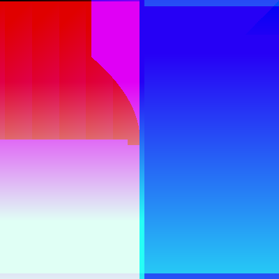

## RandomArt in python

An implementation of [Random Art idea](http://users.ece.cmu.edu/~adrian/projects/validation/validation.pdf) in python.  Inspired by https://github.com/tsoding/randomart

## Quick Start
```bash
python main.py
```


generated by the function
```
(if(gt(if(gt(-0.5831531409962822, add(0.4881374920873496, y)), -0.5363308990826867, if(gt(x, x), x, x)), mult(add(x, -0.3979345933425287), 0.005924638711300334)), if(gt(-0.7531879366483722, mod(y, x)), if(gt(y, y), y, y), -0.6988685901960758), if(gt(-0.6527899673280182, mult(x, -0.449032572506874)), if(gt(0.4990466171582677, 0.45054477619853106), -0.2123392270457356, x), if(gt(y, -0.993350726452094), 0.7644430003988048, x))), add(-0.1636800584703486, add(if(gt(x, 0.03205354156829099), -0.21411443565119748, y), mod(y, 0.9587572161753906))), if(gt(mult(mult(-0.9863596987901524, y), if(gt(y, x), x, y)), if(gt(if(gt(x, y), 0.1055739017904942, 0.3650533981892714), add(x, 0.4512269847509742)), if(gt(y, y), 0.5437715225362585, y), if(gt(0.035989977726246014, y), x, y))), add(if(gt(0.9491833056270289, 0.27379308474712905), y, x), mod(x, -0.19304693883730906)), 0.9265758698914437))
```


generated by the function
```
(if(gt(if(gt(if(gt(mult(mod(mult(mod(y, y), if(gt(0.6339704341709185, y), 0.19341773193753808, y)), if(gt(if(gt(0.4808168086528417, y), x, -0.5552428977340684), mult(0.633658985443331, x)), if(gt(0.5358355952219898, x), x, -0.8145062007305961), 0.5137468757833439)), -0.2159203783579835), if(gt(mult(mult(mult(x, -0.8118328874249869), 0.13889049928590547), if(gt(mult(y, x), -0.14971384976571556), add(-0.024131876450780743, x), if(gt(-0.4046227435961396, x), y, x))), 0.42987934750649726), mult(mult(mult(-0.10724943167424095, y), if(gt(-0.13114957175463648, -0.9646548288687495), x, x)), if(gt(mult(-0.38270139472379516, 0.8397130362566956), if(gt(x, y), 0.6066764413038463, y)), mult(y, x), -0.2900349244058904)), if(gt(if(gt(mult(0.7643636738877211, -0.45055054428800223), if(gt(0.1441159908421057, x), 0.2776304731950259, 0.5330707971269066)), add(0.1232561077632226, x), -0.4158778006909303), mult(mod(-0.857664919864386, y), if(gt(x, y), y, y))), -0.3579030830284149, 0.42316201581911117))), mod(add(if(gt(if(gt(y, y), x, -0.5035389758761406), add(y, -0.22840191973483082)), if(gt(x, -0.18279584090854195), x, x), if(gt(x, y), x, x)), mod(mod(x, -0.49523638774920253), if(gt(0.12509980154562683, y), y, 0.727155645825367))), if(gt(if(gt(0.04558476862566163, mult(x, -0.9588498523796953)), if(gt(-0.034457236368960587, y), x, x), if(gt(x, x), x, x)), add(if(gt(x, x), x, -0.3099151994339302), mod(y, x))), 0.860719701119002, 0.5810575736972132)), if(gt(0.8362594912005015, add(if(gt(if(gt(y, y), x, 0.9817564014287357), mod(y, y)), 0.5107262404552975, -0.13554036559108118), mod(mult(x, -0.5903070724735189), 0.3794522044518678))), if(gt(add(if(gt(x, y), -0.935403582337268, x), mod(-0.9329373725910908, -0.4601944201535484)), -0.6663129758619237), add(if(gt(0.6200816866495631, x), y, y), add(y, x)), if(gt(-0.03597889908795082, add(x, x)), -0.758480413510189, 0.9334157318722764)), if(gt(mod(mod(x, y), if(gt(x, y), x, x)), -0.16759936784454044), mult(mod(x, x), -0.06692041349573419), -0.005854089842331822))), add(0.5218841954123001, mult(mult(mult(mod(y, 0.3290560895084673), if(gt(x, 0.3001006138770288), 0.8946620590939534, y)), -0.10333807587744848), 0.5432151943131236))), if(gt(if(gt(add(if(gt(-0.14810040064281327, mult(x, -0.9356457164630305)), 0.9521902549034313, if(gt(0.28158044575248087, y), 0.4765938038150901, -0.6953974290213241)), mod(mult(-0.03023533091548547, x), -0.9545453885750452)), -0.9902247222104894), add(if(gt(0.5469145718978548, mult(x, x)), if(gt(x, y), -0.0028946883905740517, x), 0.5671261683494897), add(if(gt(-0.56025556840738, y), y, -0.6405753325487396), add(y, y))), 0.7594702490263541), mult(add(-0.6389524517329976, mod(mod(-0.4490294687314069, x), 0.9812921157083638)), if(gt(mult(mod(x, y), if(gt(y, x), x, -0.24856619778476352)), if(gt(if(gt(0.2378872461832302, x), 0.9361242659159079, y), add(x, y)), if(gt(0.6727212724747078, x), y, x), 0.9398371222391886)), mod(mult(x, -0.9378709143443171), if(gt(y, y), -0.7081144435984839, -0.37295126773894505)), 0.5843245786473032))), if(gt(add(if(gt(if(gt(0.6234849503605202, x), y, y), mult(x, 0.506219242553138)), if(gt(0.44794523260316854, y), y, y), if(gt(-0.11655291919319088, y), 0.36808346602788844, x)), add(0.641872676597079, add(y, -0.8453082658668865))), if(gt(if(gt(if(gt(0.7657739448146135, 0.4353442062030921), 0.5730207488211083, 0.607820579799287), mod(-0.0478351080542061, y)), if(gt(0.3443465896854512, x), x, y), if(gt(0.9518941696818364, x), x, y)), add(0.556992081980642, add(0.4323409768645188, x))), 0.6840295820184092, if(gt(add(x, y), 0.1620591158203899), add(x, x), if(gt(y, x), x, x)))), add(-0.945951706160185, mult(mult(x, y), 0.19380553013961932)), -0.5303657646894222), if(gt(if(gt(if(gt(mult(x, y), if(gt(x, 0.905765255140289), 0.6573700112573386, y)), add(y, y), if(gt(-0.5486861935506331, x), 0.6482112604136572, y)), mult(add(y, x), 0.3117750102873016)), if(gt(add(y, 0.6785570569757644), 0.07717816337184691), mult(y, y), if(gt(y, y), x, x)), if(gt(-0.2931343301645104, add(0.7527700676116784, y)), -0.5952299885157624, if(gt(-0.6777695899571778, x), y, x))), add(if(gt(0.16575016884408766, mult(y, x)), if(gt(y, x), x, x), if(gt(y, y), 0.8007296095517109, 0.05805695957308843)), mult(mult(y, y), if(gt(y, x), 0.8644271510540082, y)))), if(gt(if(gt(mod(-0.17191846367910668, y), if(gt(x, x), -0.16387202855378824, y)), add(0.16370931329278404, -0.16951019161621939), -0.36499020482232214), mod(add(-0.6877949967246169, y), if(gt(-0.7791446113270002, 0.9784591331292782), x, y))), if(gt(0.012041708823518515, mult(y, x)), if(gt(y, -0.5246849521329788), x, -0.046739241076281246), 0.6897610937748944), if(gt(if(gt(x, -0.7942324322218208), y, x), mod(y, -0.021177887908060855)), 0.5468704997681368, if(gt(0.07821173517379365, y), -0.7676616203192883, y))), -0.8058195682478881)), -0.525362736014285), mult(add(-0.9451980235173985, mod(mult(add(if(gt(y, y), y, 0.9188322433605198), mod(0.8334047517333365, x)), if(gt(if(gt(y, y), y, y), add(x, x)), if(gt(y, 0.9812245018023638), y, -0.407594507718426), -0.3308204954459497)), -0.055488846491723365)), if(gt(mod(add(if(gt(if(gt(0.8412227047538778, y), y, x), add(-0.6328762118824853, -0.5622811219077068)), 0.9803726071429661, if(gt(0.20648984712125684, x), y, y)), add(if(gt(y, x), y, 0.03372653281352611), mod(x, y))), -0.7957898733079598), 0.9038649648337587), mod(mult(add(if(gt(y, y), x, 0.5020802558048352), mult(0.90784433727724, 0.767223272376049)), if(gt(if(gt(-0.7364442837473335, y), -0.28207753678901293, 0.13701578695908578), mod(0.7967977414186689, -0.5682525424141138)), -0.605259531344917, if(gt(y, x), -0.17759781912531203, y))), if(gt(if(gt(mult(x, y), if(gt(x, y), -0.13839452466793034, -0.1004071397517623)), mult(y, x), if(gt(x, -0.9756242333698719), -0.25657453070439007, x)), mult(add(x, 0.22448861149435162), if(gt(0.3603770045717114, x), 0.1731633109668067, x))), if(gt(0.4344099051104122, mod(x, y)), if(gt(y, x), -0.9087594602602964, 0.9439456035027467), if(gt(-0.7713705458675122, y), y, x)), if(gt(if(gt(0.3826279902797247, x), -0.6037435054066693, -0.11364389151054666), mod(-0.2022872062352088, y)), if(gt(x, 0.5557696189778951), x, x), if(gt(y, x), x, -0.6519211279516413)))), 0.6872972577653909))), if(gt(0.2309366479386883, mult(mult(add(if(gt(if(gt(-0.4532751522996268, y), 0.5368795724197646, y), add(-0.45565825870591725, 0.27325473184283267)), -0.38915132439233124, -0.36102533564062145), mult(add(x, x), if(gt(0.7612830073957455, y), -0.22040868044691253, 0.6274145740803077))), if(gt(mult(mod(x, y), -0.746141796465325), if(gt(mult(y, x), if(gt(0.7831538002169971, -0.4878972254269991), -0.09033576204722626, -0.3845243695970806)), mod(x, x), if(gt(x, y), y, x))), mult(mult(-0.07076580809398902, y), if(gt(-0.3592432439829927, y), -0.9477770538318517, x)), 0.22279224353681348)), 0.7918877279809919)), if(gt(add(-0.5368665378581245, mult(mult(mod(x, x), -0.07017709853939857), if(gt(mod(x, 0.9629834313028298), if(gt(x, -0.14926966957201127), x, 0.8475495020215191)), add(0.5009897037334834, x), -0.4546899724548932))), if(gt(if(gt(add(-0.4408778147688708, mult(0.9791330513484955, x)), if(gt(if(gt(y, 0.8269718218787829), -0.18486626996819333, -0.36690746534046714), add(0.6559944658654675, y)), if(gt(y, -0.576788190835315), y, x), 0.8288856732087075)), add(0.14114861287138347, add(y, -0.20808976306785398)), 0.3458824085104468), add(if(gt(mult(-0.9766279697551379, y), if(gt(x, x), 0.18131525335369236, -0.9207884864455904)), add(y, y), -0.41945625218317595), mult(add(-0.9174772278501628, x), 0.4054647977165924))), if(gt(if(gt(if(gt(x, x), -0.9302321963214428, -0.5338459604743115), mult(y, y)), if(gt(-0.09986958455560191, y), y, 0.7755460010227193), if(gt(x, y), -0.7502963099484967, 0.3622846396419963)), mult(mult(y, y), if(gt(0.4451945493530194, 0.39748699878547855), x, x))), if(gt(if(gt(y, -0.9051340581454921), x, y), mod(x, y)), 0.03955132318908894, 0.2779381798674385), if(gt(-0.26968662800691456, mult(y, 0.5039801345221926)), if(gt(x, x), y, x), if(gt(0.24100032493211, x), -0.441914112516534, x))), if(gt(mult(add(y, x), -0.5960507933562005), 0.19754085864252224), mod(add(0.4688831026563154, x), if(gt(0.6478371324998831, y), y, x)), if(gt(mod(y, -0.9428763733423573), if(gt(x, 0.614947193472112), -0.2210410833226808, y)), mod(0.7961987877426637, -0.8672374680883872), if(gt(x, y), -0.3215637981600663, y))))), mod(add(if(gt(add(x, 0.6877687042314113), if(gt(0.7289791004264661, x), x, -0.6334750278340391)), mod(y, -0.8972263880099947), 0.6904408892049942), mult(mod(-0.9804689576225283, x), if(gt(y, x), x, 0.13255174424204963))), if(gt(if(gt(add(y, x), -0.3932011687948309), mod(0.7495339423408989, x), if(gt(x, y), y, 0.9334165863166117)), mod(add(y, y), if(gt(0.11509814834684673, y), 0.9675678382912958, x))), 0.45781505804314127, -0.1881847116796671)), if(gt(add(if(gt(mult(x, x), if(gt(y, y), y, y)), mult(y, y), -0.9206062271171775), mult(mult(y, x), if(gt(y, y), y, 0.7999365448348694))), if(gt(add(0.30212527838767333, add(y, x)), if(gt(add(-0.6007561242591004, y), if(gt(x, x), x, -0.9879580950472078)), mult(x, -0.5837643059799857), 0.2485992540428228)), mult(add(0.47919310080247546, y), if(gt(x, -0.5854558603162037), y, x)), -0.4600731470276844)), mult(mult(mult(0.43733441585240684, -0.15637874542702113), -0.4989547197582478), if(gt(if(gt(-0.1445284149674959, y), y, 0.305627281815154), mult(y, x)), if(gt(0.707578994105895, 0.8910463890298348), -0.21975788592838952, x), if(gt(x, y), 0.5319002413828111, y))), if(gt(if(gt(-0.6397076027609456, mult(x, x)), if(gt(y, y), 0.8899783817031275, 0.09298050012587589), 0.4554953896251248), mult(add(0.3345897009364802, x), if(gt(y, x), -0.5151115421036703, x))), 0.004012830188456773, if(gt(if(gt(y, y), y, -0.9419427106694358), mod(y, y)), if(gt(0.0613710853649716, 0.12959733128624662), 0.1875813933206909, y), if(gt(x, -0.6593566273349787), y, x))))), 0.8575066201835904), 0.9465245389048935), add(if(gt(-0.6558048652862938, mod(mult(mod(mult(mod(x, -0.7828837349613667), 0.4461802829921391), if(gt(if(gt(-0.18603995282152952, x), x, 0.228011421656394), mod(y, -0.49415145794030035)), 0.46008488287046356, if(gt(0.30727174095722787, x), -0.17432902552847196, y))), if(gt(mult(mult(-0.4801279460599086, -0.2215958608955262), if(gt(y, x), x, x)), if(gt(add(y, y), if(gt(0.9445416550341472, 0.2450621821045822), y, y)), add(y, x), -0.6598088189152118)), add(if(gt(x, 0.7602424739870917), y, -0.28493722787608533), mult(y, -0.7652111226744573)), if(gt(0.8928419651374937, mult(-0.9084704472411707, -0.9867491989077302)), if(gt(y, y), 0.5218678268203691, -0.7286393083220479), 0.04478701260105722))), 0.4285565686418171)), 0.6840712334543952, if(gt(if(gt(if(gt(-0.7976241236077348, mult(add(y, 0.31343356423616453), if(gt(x, x), y, -0.4755664323491986))), if(gt(if(gt(y, -0.6883833632854162), -0.24306522936834574, y), mult(0.46671775941344684, y)), if(gt(x, x), y, x), 0.3445097500979022), if(gt(mult(0.4406504197983696, -0.1616596078452377), if(gt(y, x), y, y)), add(-0.9016724423150315, y), 0.27799301309075153)), mult(mult(add(-0.10692312350866451, -0.6062036989521042), if(gt(x, y), 0.49331752119182126, x)), if(gt(mult(x, 0.3033624235159931), 0.38438627178393436), add(x, -0.03927429853133235), if(gt(x, -0.4043617497736609), 0.002049521462984538, x)))), if(gt(mod(add(y, x), if(gt(x, x), y, -0.2647608385385758)), -0.619189215581686), mult(mult(0.9687083627283981, x), if(gt(x, 0.3648122790485373), y, y)), -0.9383334026077752), 0.69778815110485), mult(mult(add(if(gt(x, y), y, x), mult(y, y)), if(gt(-0.33629478612257535, mod(y, x)), if(gt(-0.6814184962302401, x), y, x), if(gt(y, -0.8615253193177244), x, y))), if(gt(-0.15555468981440268, mult(mod(0.26750348411417013, y), if(gt(0.1970627638491922, 0.7307323473722569), -0.39419039736178885, x))), if(gt(if(gt(x, y), x, y), mult(x, 0.07673637367327601)), if(gt(y, y), -0.3272430421321677, x), if(gt(y, x), x, y)), if(gt(add(x, 0.2648765159417279), if(gt(y, x), x, -0.6066546475635646)), mod(0.7908220500719083, -0.8443209624647918), -0.6458694001239302)))), 0.9733925034307538, -0.04016795656422345)), add(-0.14637976967837107, mult(mod(add(-0.3223057392046895, mod(mult(-0.17470287735633572, x), if(gt(x, -0.20079121491087681), y, y))), if(gt(if(gt(add(x, x), if(gt(y, 0.9349804095442951), -0.047128848253812805, y)), add(-0.9294322265877968, 0.7447754199874272), if(gt(x, 0.045359700983119255), y, x)), mod(add(0.20597126100310836, x), if(gt(x, y), -0.9994142790692264, x))), if(gt(add(y, y), -0.1864665200020299), mod(-0.020891026633488963, y), 0.5562367170072751), 0.9406044452075661)), if(gt(mult(add(if(gt(x, y), -0.7662617229047379, 0.5260571372121112), mult(-0.18240727367086107, x)), -0.08696933614407354), if(gt(mod(add(y, y), if(gt(x, y), y, -0.4789776556231067)), -0.47149247741258926), mod(mod(y, y), -0.30081728609551317), if(gt(add(y, x), -0.8890205616021338), mult(-0.4310527131529174, -0.06791753570422498), 0.019963588730113058))), add(-0.03623166215637097, mod(mult(y, -0.39293127506931125), if(gt(y, y), -0.780895102524569, x))), if(gt(mult(mod(x, y), if(gt(x, y), x, x)), if(gt(if(gt(y, x), 0.3393963239315503, x), mult(x, y)), -0.9901194055454476, 0.10165451218361854)), mult(mult(y, y), -0.5442789254903084), if(gt(if(gt(y, x), x, y), add(-0.8602265995030833, x)), if(gt(x, 0.1797201018075676), x, -0.9987530317330413), if(gt(-0.8774449723517681, 0.5157138254117457), y, 0.5909985091393795))))))), if(gt(if(gt(add(0.06575090366433378, add(0.03020253001782147, add(if(gt(add(y, y), if(gt(x, y), x, -0.4375604930579746)), mod(y, 0.4781018817384368), if(gt(x, -0.28157419484991086), -0.19781363514377714, y)), mod(mult(x, x), if(gt(0.19717319297285396, x), -0.34620259821990906, -0.09231911713720509))))), if(gt(0.0845629027329089, mod(mult(mod(add(-0.3717442123278345, x), if(gt(-0.8896828184657137, -0.5918172148931529), 0.678262904234552, x)), 0.9119161309819668), 0.2841007313463437)), 0.47972792141893894, if(gt(if(gt(-0.7865740294046866, mod(mult(x, y), if(gt(y, -0.2503180768951918), x, -0.37355277046177005))), 0.7412767923659522, 0.040744114628244565), add(-0.2455348171142322, add(if(gt(x, x), y, 0.8577290558967614), mult(x, y)))), if(gt(if(gt(mult(-0.7679315671651772, -0.3478097103437183), if(gt(y, 0.8128263372535678), 0.18031872909677893, 0.5439381827764282)), mult(y, y), if(gt(x, y), -0.3259801780112461, x)), add(if(gt(y, y), -0.3317230098070467, y), mult(x, 0.3172378922326269))), if(gt(mult(y, x), -0.6342904613048501), add(y, x), -0.6799052551378404), if(gt(mod(0.8916039442475727, x), -0.9827865243215164), add(x, x), if(gt(y, x), x, y))), if(gt(add(if(gt(x, -0.06854657429739963), x, y), mult(0.8800775238547676, 0.8347170217107742)), if(gt(add(-0.2577794049584048, y), -0.1477554652659292), mult(x, x), if(gt(x, -0.45926957234113175), y, x))), mult(add(x, x), -0.49688315892516965), if(gt(if(gt(y, 0.34581935458235646), -0.11501242072293572, x), add(y, 0.6157842025610558)), if(gt(y, y), x, -0.47772272284849504), if(gt(y, y), y, y)))))), mult(mod(mult(add(if(gt(x, x), y, 0.6209645370706145), mult(-0.1909209418709772, y)), -0.05836600597391328), -0.9045823427344812), if(gt(mult(mult(mult(-0.05550141780318785, y), if(gt(-0.7591600784910506, 0.7381616201806822), 0.8717866056000019, 0.09437072758887433)), if(gt(if(gt(-0.6263925638513199, x), y, x), mult(y, x)), if(gt(y, 0.36279585390586333), y, y), 0.9429565018043984)), if(gt(-0.7229540896693525, mult(add(-0.9128195466734625, -0.7242275601541506), 0.8183853827953924)), if(gt(if(gt(x, x), x, y), mod(0.5191131020151394, x)), 0.10091734352528547, 0.15181084743303463), if(gt(if(gt(y, 0.8692290001619931), x, y), add(y, 0.8017589955230178)), if(gt(0.41045640320399435, y), 0.590702347281072, -0.6384446615235819), if(gt(-0.5640686500136416, y), x, y)))), mult(add(if(gt(-0.7684961689477452, 0.43326539538837494), x, -0.04610412528991503), add(0.7406835812437946, x)), 0.6182804983927641), -0.5879846659574688)), if(gt(if(gt(mod(mod(add(x, 0.20563545430562957), 0.8581120558782545), if(gt(add(x, y), -0.8334023693467214), mult(x, -0.7869521113160456), if(gt(0.9851441809114898, 0.7876178189480569), y, -0.2059477215178418))), if(gt(-0.07199608773483734, mod(mult(y, x), if(gt(x, y), x, x))), if(gt(if(gt(y, x), x, x), mult(x, 0.40077447993352355)), -0.13892987445169647, -0.9851336430440287), if(gt(if(gt(0.6637297426611628, y), x, -0.5627994145550352), add(0.6511877712509422, x)), -0.9470874505205595, -0.44757715236924045))), mult(add(0.03876277419063534, mult(x, 0.7322487417386496)), 0.3101822409262269), if(gt(mult(add(y, x), if(gt(x, 0.42729093765945203), y, x)), if(gt(add(y, x), -0.7177654909108633), add(x, -0.2943118164181091), if(gt(0.8662949547266021, x), y, -0.474808005691042))), add(if(gt(x, y), x, x), mult(x, 0.6493788089984334)), if(gt(if(gt(y, x), x, x), mult(0.10149886839283218, 0.4063102370411542)), if(gt(0.6063266919545642, -0.15084116866219244), x, -0.06909472689420504), if(gt(x, -0.32381238270624224), -0.494109336852703, x)))), mult(mult(mod(mult(x, x), if(gt(y, 0.2549773330989473), x, x)), if(gt(if(gt(y, y), y, x), mult(0.6199337691631297, -0.9879724188062446)), if(gt(x, x), x, y), -0.8636321826135667)), if(gt(mod(mult(y, x), if(gt(x, y), -0.3348968304352953, y)), if(gt(mult(0.8149101637943417, x), 0.6917058395250921), add(0.7223689286516017, x), if(gt(0.18841280854849152, x), x, x))), mult(mod(0.051784579577055734, y), -0.8114237133185638), if(gt(mult(y, x), if(gt(0.44482368874164124, 0.4190459182843864), -0.5422783869526051, 0.7588020534357152)), add(0.7141443542379158, x), if(gt(x, y), 0.5705551753697751, y))))), -0.455341100218726, if(gt(mult(add(0.9512738013196274, mult(y, -0.621177482422774)), -0.580948980066571), if(gt(mod(mod(x, -0.5473680122823785), if(gt(x, x), x, x)), if(gt(-0.19875478541674108, mod(0.7722041015131405, y)), if(gt(0.587651691583507, -0.0532570091921285), 0.1206427551564555, 0.5736744942441372), if(gt(0.5974550186925827, x), x, x))), add(0.7287147095697912, add(-0.8038987267125888, y)), if(gt(0.7232101565403566, add(0.7057854799657155, x)), -0.4934218396651662, if(gt(-0.024201386077513876, x), -0.6089953827754018, y)))), mod(mult(mod(-0.04118319778249813, x), -0.26923923453059007), if(gt(-0.1942815381378611, mult(0.8299914764178407, y)), -0.8798049922685469, -0.21271301004576126)), if(gt(mult(mult(-0.5010663820535883, y), if(gt(-0.8317382945544205, -0.5098327165734224), x, -0.6565821377585526)), -0.3886399078452567), mult(mult(x, -0.4400314713764686), if(gt(0.8949913567742798, x), x, x)), 0.5870231938636516)))), mod(add(if(gt(if(gt(if(gt(add(-0.5476540216378492, x), if(gt(y, 0.45364437633093924), y, y)), add(y, 0.5250932563369264), if(gt(x, -0.4211750863171002), x, 0.5211508729860539)), mult(mult(y, 0.36078470819821584), 0.22705725805624866)), if(gt(add(0.2808701917863059, x), if(gt(y, y), -0.8378334569382138, y)), add(y, y), if(gt(x, x), -0.12529618551683885, y)), if(gt(0.835239314107195, mult(0.8803060769988968, -0.08669703685143926)), if(gt(0.2710775995046393, 0.29024821998632255), 0.1411446824069793, x), if(gt(y, -0.39012475747688447), 0.5379385569850359, 0.9149176316270355))), mod(add(if(gt(y, y), -0.5935505820799987, x), mult(y, y)), if(gt(add(0.7636244469231659, x), -0.14657241505041685), add(x, y), if(gt(0.846783600352415, -0.8244861927416107), x, -0.48612305861687233)))), if(gt(mod(mult(x, 0.1375785581346245), if(gt(x, x), x, -0.35349742664973083)), if(gt(mod(y, y), if(gt(x, x), x, y)), mod(y, x), -0.3613997327514886)), mult(mod(x, x), 0.8689823471179681), if(gt(mult(-0.6126936305791038, y), 0.653437054501508), add(y, x), if(gt(-0.5459810623067822, y), y, y))), if(gt(mult(mod(y, 0.24767221932151795), if(gt(x, 0.7216956541725235), -0.4583353909512662, 0.5159866109890567)), if(gt(mult(-0.5935056694128469, y), -0.25719896758141925), mod(0.4635728770810137, -0.017632664313138813), 0.4319387793007585)), add(0.8177319603840845, mult(x, x)), if(gt(if(gt(y, 0.5712686832467664), y, y), mult(0.8330595627455872, -0.7761347027488401)), if(gt(x, y), y, 0.14870344403820712), if(gt(0.16581259843281004, -0.6119183980783711), x, -0.0825483892359673)))), add(if(gt(mod(mod(x, 0.034305061197798414), 0.3911783792979828), if(gt(-0.23608976534517256, mult(0.8602666781075599, x)), if(gt(y, 0.3944004230912106), y, -0.9749716169643874), if(gt(x, 0.7354739658523981), x, x))), mod(mult(-0.25101311690948047, 0.28619876309305825), if(gt(y, x), x, x)), if(gt(0.6869022772869411, mult(0.46583873644972584, -0.29247853321326045)), if(gt(y, -0.9727195540619751), 0.48563793186840876, x), if(gt(x, -0.4815421167610392), y, -0.9576497626564862))), mod(add(0.31363784266627626, mod(0.9232816012341878, y)), if(gt(if(gt(y, x), 0.46353537147145984, x), mult(y, x)), 0.14361950326680617, if(gt(y, x), x, x))))), if(gt(mult(mult(add(if(gt(0.6639121663025649, 0.14961064922342682), 0.7616323819949604, -0.9517216416593353), mult(-0.5809041215596362, x)), if(gt(mod(y, x), if(gt(-0.9214246100394925, 0.3963339378245436), 0.29382138491120924, y)), add(x, y), if(gt(y, x), x, 0.4610916858288179))), if(gt(if(gt(mult(y, -0.08895343544677803), if(gt(x, x), x, -0.41064896937936557)), mult(y, 0.6963889607450844), -0.875078572560672), mult(add(-0.15941710496002148, y), if(gt(y, y), y, -0.0755666501839336))), if(gt(0.755060913566328, mult(x, x)), if(gt(y, 0.49627542293510096), 0.024860422804423132, y), if(gt(y, 0.38325234815157616), x, x)), if(gt(if(gt(y, y), -0.8111164511001938, 0.9590162318736024), mult(x, y)), if(gt(-0.6125873529553754, x), x, y), if(gt(y, x), y, 0.6293128721858201)))), if(gt(add(if(gt(if(gt(0.7435372736637049, y), y, y), add(0.6307839765424881, x)), if(gt(x, x), x, -0.16644656133518843), 0.5952886724866153), mod(add(x, x), 0.9941284654479363)), if(gt(-0.3164131589203527, mult(mult(x, 0.23644357741511524), -0.9539953565718706)), 0.8088376335956202, if(gt(mod(y, -0.9741380663117187), 0.8482317562257682), mult(-0.4582024289159643, -0.3758217318603403), if(gt(x, y), 0.30533343327798423, y)))), mult(mult(add(y, 0.5982848361596134), -0.7419688951743577), if(gt(if(gt(x, -0.8127298400792631), x, y), add(0.869746750798543, y)), if(gt(-0.3459294553378729, -0.11202668131862481), -0.24018455080121326, x), if(gt(x, y), 0.6881931107262136, -0.6288218810097186))), if(gt(if(gt(if(gt(-0.24492272003239246, x), y, y), add(0.3937746565882436, y)), if(gt(x, 0.1342323321150949), y, x), if(gt(x, x), -0.6320197023471357, 0.5577227463862631)), mod(mult(0.3896360178348599, y), -0.7760714767203949)), 0.33699531895682466, if(gt(if(gt(y, x), -0.8280025979110641, x), mult(0.7069040128138442, y)), if(gt(-0.8711466340228711, x), x, -0.5782579171269673), if(gt(0.028833406376173265, y), x, 0.49800998378867245))))), add(if(gt(if(gt(mult(x, y), if(gt(y, x), y, 0.10948985029206182)), mult(y, y), -0.27369721243517176), mult(mult(-0.19832943093437994, -0.41825357140998287), if(gt(x, y), y, -0.12864574506756177))), if(gt(mod(-0.07549448081577115, -0.9657833546673227), if(gt(-0.46998965935218195, 0.8622121272248879), y, y)), mult(-0.8566270209691291, x), if(gt(0.8123365802038098, x), -0.8271502919695721, x)), if(gt(mod(x, x), 0.18891997709304897), mod(y, x), 0.6192043208444278)), mod(mod(add(y, y), if(gt(x, x), -0.6044091795310564, y)), 0.6924959427979833)), if(gt(mult(add(-0.3313875860876021, mod(0.17730122491804723, x)), -0.08130206106162641), 0.24098153377809073), add(-0.25458721847213095, mod(mult(x, y), -0.6558185019217861)), -0.23022922083745412)))), if(gt(mult(mod(add(if(gt(0.24514548853335372, add(0.29767183093014005, -0.9064302378965909)), -0.3308456295424498, 0.6820468341059445), add(if(gt(0.9447320715866716, y), y, y), add(y, x))), if(gt(mod(mult(-0.9616223116397364, x), -0.5265056810103372), if(gt(if(gt(-0.9707222339467156, y), x, y), mult(x, x)), 0.06433933594765873, if(gt(-0.75234824364445, y), y, x))), mult(mult(x, y), -0.07139299244014885), if(gt(-0.7873246624086359, add(y, y)), if(gt(0.12124066545238876, y), x, -0.21410621369588867), if(gt(y, 0.7707989731157503), x, x)))), if(gt(if(gt(mod(mult(y, x), if(gt(y, -0.44217109610467387), x, y)), if(gt(mult(-0.17515112673869337, 0.8384750223492248), if(gt(y, -0.19455338813770084), 0.4398628096893791, x)), mod(x, -0.6715627151608425), -0.7440715133464937)), add(if(gt(y, 0.5697034938619119), y, x), add(0.32714012507210577, y)), if(gt(if(gt(-0.43951261986097667, y), x, x), add(x, -0.8947273369387012)), if(gt(x, y), 0.4952614369324486, x), if(gt(x, 0.4900030052085771), -0.7473714314605422, x))), mult(mod(add(-0.4763232353325373, x), 0.8750712065115784), -0.30342418162385965)), if(gt(mult(add(x, -0.5587785689358784), if(gt(0.4281848264740957, y), x, -0.09931890656830755)), -0.5846601795823931), add(-0.2831313255779173, mod(0.7757743722083976, -0.06147379311856138)), if(gt(add(x, -0.16299303652153996), if(gt(y, x), 0.853921127524335, y)), add(y, x), if(gt(y, y), y, x))), if(gt(mult(add(0.879923313160869, y), if(gt(x, 0.2846852402487532), -0.15701654203535909, x)), if(gt(0.42720607242003483, mod(-0.5470664391318454, 0.6308777712728761)), -0.7032903403002182, if(gt(y, y), x, y))), add(-0.07177945047172285, mod(x, y)), if(gt(if(gt(x, y), x, x), mult(x, y)), if(gt(x, 0.018561301683074127), y, y), 0.770717540401912)))), if(gt(add(-0.08592701172233208, mod(add(0.4564167076145278, mult(y, y)), if(gt(if(gt(y, 0.7588401061258645), y, 0.05646623444262233), mod(0.1292716557702589, x)), if(gt(-0.4696462582026113, y), y, y), 0.83302238325847))), -0.9018514732478833), mult(mod(add(if(gt(y, x), x, x), mult(-0.4448694864476117, -0.9479954917004778)), if(gt(mult(x, 0.9429084248370299), if(gt(y, y), x, x)), mult(y, x), 0.7331887522144422)), if(gt(if(gt(mod(x, y), if(gt(y, 0.9729652120305863), x, x)), add(y, x), if(gt(x, x), 0.35948128495014364, x)), add(0.7702385221815444, mod(0.7775837622496884, y))), 0.734321325317838, if(gt(0.4729629990251165, add(y, -0.19079866120481404)), if(gt(y, -0.9079758260240913), x, -0.6154987666163321), if(gt(-0.4207776475802001, y), 0.9535840643182063, -0.028716546881941696)))), -0.7353120889487019)), add(0.5349147096641256, mod(mult(add(if(gt(x, y), y, -0.5256438685747875), mod(y, y)), 0.4498948918746455), if(gt(if(gt(if(gt(y, 0.5221525122234563), y, x), add(0.139800361831236, 0.15281534816980713)), if(gt(-0.55060903357589, -0.40679335107977344), x, y), -0.032602064652028195), mult(mod(x, x), if(gt(x, x), -0.5950772192728293, x))), 0.04126294917658169, if(gt(if(gt(x, -0.08897773348876803), x, -0.6393400098447681), mult(y, x)), if(gt(x, y), x, -0.5517871971227772), if(gt(x, -0.5990575979771577), x, -0.29933954316236333))))), if(gt(mult(mult(mult(add(y, -0.9228900012249761), -0.17784987855158452), if(gt(mult(y, y), if(gt(x, -0.42546397896126864), x, -0.06703860548371798)), mult(x, x), -0.491383797363137)), 0.0709119885908096), if(gt(mult(add(0.5854366795248711, mod(x, y)), if(gt(mult(-0.7830915876593345, y), 0.9686725951361326), mod(x, y), 0.9287954568042986)), 0.2579494065193808), mod(add(if(gt(y, y), -0.7199379410656943, x), add(x, 0.7213272944472338)), if(gt(if(gt(y, 0.7478528944713667), y, x), mult(x, y)), if(gt(-0.6644369166377917, y), y, y), -0.3151540534928896)), if(gt(0.17007317562397706, mult(add(x, y), 0.26716076383908227)), if(gt(mod(0.6080923461845211, x), 0.2280331661027648), add(y, x), if(gt(0.19682891758070964, x), -0.2894090018321662, y)), if(gt(if(gt(x, -0.8076296393058375), y, x), mult(x, -0.5506420484450074)), if(gt(-0.8336889582826144, x), y, x), -0.9885248717635973)))), add(if(gt(if(gt(mult(-0.33562402602477204, y), if(gt(y, y), x, x)), mult(y, 0.3180865224921181), if(gt(y, 0.8116645165604912), x, y)), mod(add(y, y), 0.8546749062202466)), -0.28562650760495445, if(gt(0.16005756012143757, mult(y, x)), if(gt(0.5258458935717711, y), -0.5045246738563414, -0.23509158740035496), 0.8813007117339886)), add(0.5540026857212261, add(if(gt(0.0010154269465929566, 0.24835195231142793), x, y), mult(y, x)))), 0.7757202668513656)), -0.8821930691952151))
```
